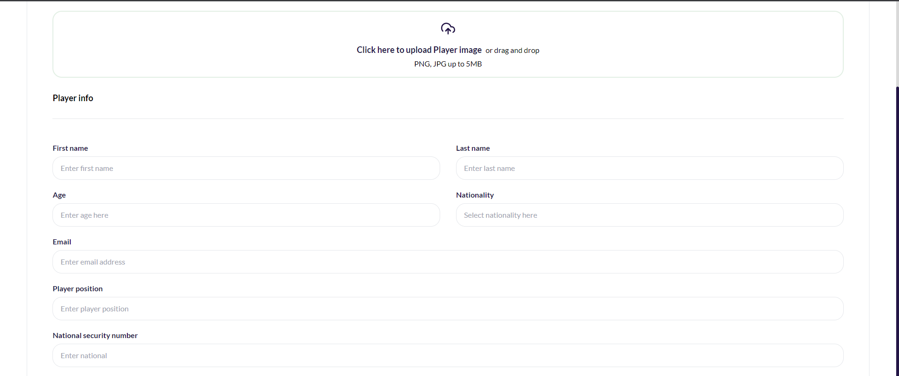
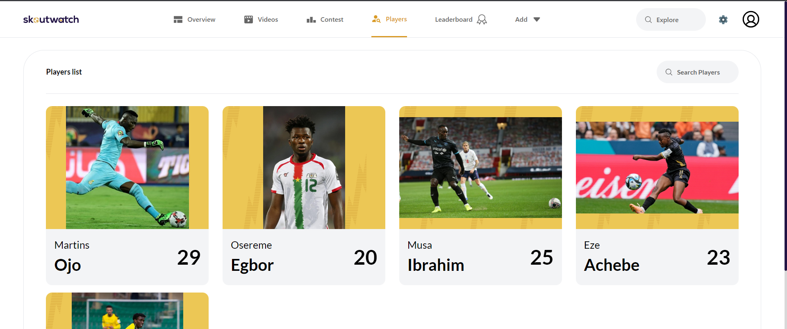
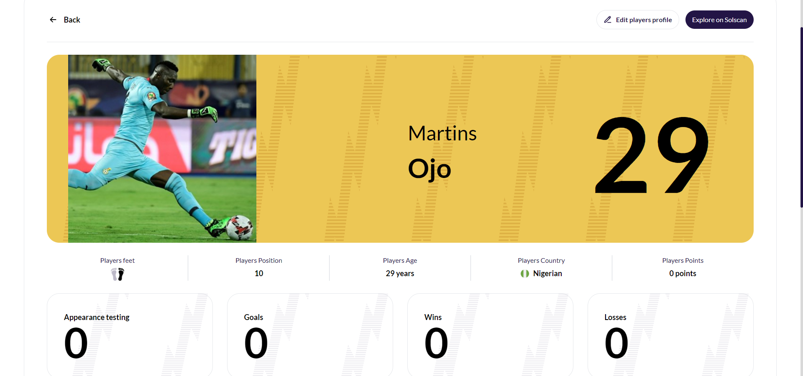
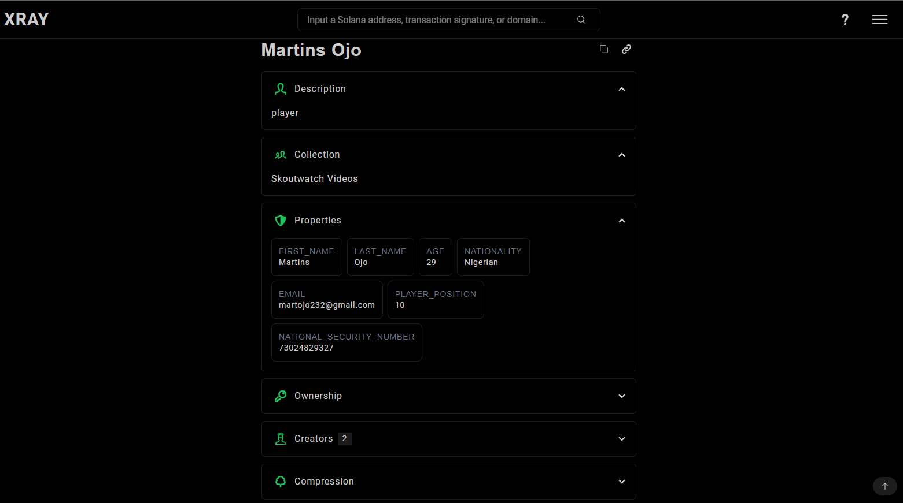

[](https://github.com/Skoutwatch/skoutwatch-frontend/graphs/contributors)
[](https://github.com/Skoutwatch/skoutwatch-frontend/forks)
[](https://github.com/Skoutwatch/skoutwatch-frontend/issues)

<!-- PROJECT LOGO -->
<br />
<div align="center"> 
  

  <h3 align="center">Frontend Assessment Test</h3>

  <p align="center">
    Players Skouting
    <br />
    <a href="https://main.d1y9ht4tz4qfys.amplifyapp.com/"><strong>View Demo »</strong></a>
    
    
  </p>
</div>

<!-- TABLE OF CONTENTS -->
  <p>Table of Contents</p>
  <ol>
    <li>
      <a href="#about-the-project">About The Project</a>
      <ul>
        <li><a href="#built-with">Built With</a></li> 
      </ul>
    </li>
    <li>
      <a href="#getting-started">Getting Started</a>
      <ul>
        <li><a href="#prerequisites">Prerequisites</a></li>
        <li><a href="#installation">Installation</a></li>
      </ul>
    </li>
    <li><a href="#usage">Usage</a>
    <ul>
       <li><a href="#api-consumption">API Consumption</a></li>
    </ul>
    </li> 
  </ol>

<!-- ABOUT THE PROJECT -->

## About The Project


This is a frontend application built with React.js that consumes the endpoints listed at https://devnet.underdogprotocol.com/v2/projects.

It takes care of:

- creating players
- Viewing upcoming matches and ongoing matches
- Viewing players

While utilizing the underdog technology

## Built With

[](https://reactjs.org/)
[](https://redux.js.org)
[](https://tailwindcss.com/)

<!-- GETTING STARTED -->

## Getting Started

To get a local copy up and running follow these simple example steps.

### Prerequisites

You need to have `npm` installed on your computer in order to be able to install and run the project.

- npm
  ```sh
  npm install npm@latest -g
  ```

### Installation

Below is an example of how you can instruct your audience on installing and setting up your app. This template doesn't rely on any external dependencies or services.

1. Clone the repo
   ```sh
   git clone https://github.com/Skoutwatch/skoutwatch-frontend.git
   ```
2. Install NPM packages
   ```sh
   npm install
   ```
3. Run the Project
   ```sh
   npm start
   ```
4. Navigate to `http://localhost:3000/` (or the exposed port) on your favourite browser

<!-- USAGE EXAMPLES -->

## Usage

The following shows the functionality of the application with respect to the endpoints provided.

### API Consumption

```js
export const getDataApi = async (url, token) => {
  const res = await axios.get(
    `
${process.env.REACT_APP_BASE_URL}/${url}`,
    {
      headers: {
        Authorization: `Bearer ${process.env.REACT_APP_API_KEY}`,
      },
    }
  );
  return res;
};

export const postDataApi = async (url, post, token) => {
  const res = await axios.post(
    `
${process.env.REACT_APP_BASE_URL}/${url}`,
    post,
    {
      headers: {
        Authorization: `Bearer ${process.env.REACT_APP_API_KEY}`,
      },
    }
  );
  return res;
};

export const logoutApi = async (url, token) => {
  const res = await axios.post(
    `
${process.env.REACT_APP_BASE_URL}/${url}`,
    {
      headers: {
        Authorization: `Bearer ${process.env.REACT_APP_API_KEY}`,
      },
    }
  );
  return res;
};

export const putDataApi = async (url, post, token) => {
  const res = await axios.put(
    `
${process.env.REACT_APP_BASE_URL}/${url}`,
    post,
    {
      headers: {
        Authorization: `Bearer ${process.env.REACT_APP_API_KEY}`,
      },
    }
  );
  return res;
};

export const patchDataApi = async (url, post, token) => {
  const res = await axios.patch(
    `
${process.env.REACT_APP_BASE_URL}/${url}`,
    post,
    {
      headers: {
        Authorization: `Bearer ${process.env.REACT_APP_API_KEY}`,
      },
    }
  );
  return res;
};

export const deleteDataApi = async (url, token) => {
  const res = await axios.delete(
    `
${process.env.REACT_APP_BASE_URL}/${url}`,
    {
      headers: {
        Authorization: `Bearer ${process.env.REACT_APP_API_KEY}`,
      },
    }
  );
  return res;
};
```

### 1. Create player

```js
const res = await postDataApi(`${projectId}/nfts`, {
  attributes: data,
  name: name,
  symbol: "swu",
  description: "player",
  image: image,
});
```

<table>
<tr>
<th>Component</th>
<th>API Call</th>
</tr>
<tr>
<td>
  

<p>./src/pages/addplayer.js</p> 
<p><strong>Add player Screen</strong></p>
</td>
<td>

```js
// ./src/redux/actions/playersAction.js
export const createPlayer = (data, image) => async (dispatch) => {
  const projectId = process.env.REACT_APP_PROJECT_ID;
  const name = `${data.first_name} ${data.last_name}`;

  try {
    dispatch({ type: GLOBALTYPES.PLAYER_CREATE });

    const res = await postDataApi(`${projectId}/nfts`, {
      attributes: data,
      name: name,
      symbol: "swu",
      description: "player",
      image: image,
    });

    dispatch({
      type: GLOBALTYPES.PLAYER_SUCCESS,
      playload: res,
    });
  } catch (error) {
    dispatch({
      type: GLOBALTYPES.PLAYER_FAILURE,
      payload: {
        error: "An error has occured",
      },
    });
  }
};
```

</td>
</tr>
</table>

<br/>

### 2. View all players

```js
const res = await getDataApi(`${projectId}/nfts`);
```

<table>
<tr>
<th>Component</th>
<th>API Call</th>
</tr>
<tr>
<td>
  

<p>./src/pages/addplayer.js</p>
<p><strong>View all players screen</strong></p> 
</td>
<td>

```js
// ./src/redux/actions/playersAction.js
export const getPlayers = () => async (dispatch) => {
  const projectId = process.env.REACT_APP_PROJECT_ID;
  try {
    dispatch({ type: GLOBALTYPES.GETPLAYER_REQUEST });

    const res = await getDataApi(`${projectId}/nfts`);

    dispatch({
      type: GLOBALTYPES.GETPLAYER_SUCCESS,
      payload: res,
    });
  } catch (error) {
    dispatch({
      type: GLOBALTYPES.GETPLAYER_FAILURE,
      payload: {
        error: "An error just occured",
      },
    });
  }
};
```

</td>
</tr>
</table>

<br/>

### 3. View one player

```js
const res = await getDataApi(`${projectId}/nfts/${id}`);
```

<table>
<tr>
<th>Component</th>
<th>API Call</th>
</tr>
<tr>
<td>


<p>./src/pages/players/[id].js</p>
<p><strong>View one player screen</strong></p>  
</td>
<td>

```js
// ./src/redux/actions/playersAction.js
export const getOnePlayer = (id) => async (dispatch) => {
  const projectId = process.env.REACT_APP_PROJECT_ID;
  try {
    dispatch({ type: GLOBALTYPES.GETPLAYER_REQUEST });

    const res = await getDataApi(`${projectId}/nfts/${id}`);

    dispatch({
      type: GLOBALTYPES.GETPLAYER_SUCCESS,
      payload: res,
    });
  } catch (error) {
    dispatch({
      type: GLOBALTYPES.GETPLAYER_FAILURE,
      payload: {
        error: "An error has just occured",
      },
    });
  }
};
```

</td>
</tr>
</table>

<br/>

### 4. Explore on solscan

```js
`https://xray.helius.xyz/token/${mintaddress}?network=devnet`;
```

<table>
<tr>
<th>Component</th>
<th>API Call</th>
</tr>
<tr>
<td>


<p><strong>View one player on solscan</strong></p>  
</td>
<td>

```js
// ./src/pages/players/[id].js
<a
  href={`https://xray.helius.xyz/token/${onePlayer?.mintAddress}?network=devnet`}
  target="_blank"
  rel="noopener noreferrer"
>
  <button className="text-white text-[14px] md:text-[16px] bg-primary py-[8px] md:py-[10px] px-[12px] md:px-[16px] rounded-[30px]">
    Explore on Solscan
  </button>
</a>
```

</td>
</tr>
</table>

<br/>
